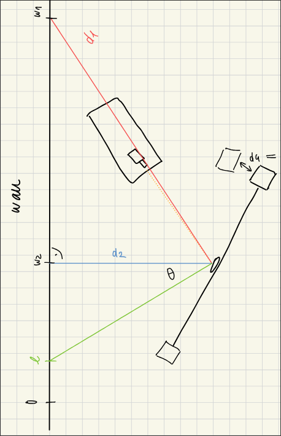

# Length measurements

All images are uploaded [here](https://drive.google.com/drive/folders/1Izo4OTF3CGaBjcfKXcR-0cL6bZGwFbdK): measurements 1 and 2 were taken on Thursday, 17.4.25, and measurements 3 and 0 were taken on Wednesday, 23.4.25. `measurement*a` is without additional weights (reference) and `measurement*b` is with additional weights to measure gravity. Measurement 0 is to find the distance from the pendulum to the weights from measurement 3b.

The positions (on the wall) were taken from a fixed tape measure.

$w_1$ denotes the position of the laser on the wall (behind the laser source), $d_2$ is the perpendicular distance from the mirror to the wall and $w_2$ is the perpendicular position of the mirror on the wall:

Measurement 1:

| Name | Length [cm] |
| --- | --- |
| $w_1$ | 378 |
| $d_2$ | 190 |
| $w_2$ | 205 |

Measurement 1:

| Name | Length [cm] |
| --- | --- |
| $w_1$ | 273 |
| $d_2$ | 190 |
| $w_2$ | 204 |

Measurement 3:

| Name | Length [cm] |
| --- | --- |
| $w_1$ | 25 |
| $d_2$ | 188.5 |
| $w_2$ | 204 |

The aluminium rod is 100cm long (without screws) and weighs 441g (with mirror). The two weights on the pendulum are made of lead and both have dimensions of 9.9 x 10.0 x 10.0cm, with each a screwhole of 2.2ml. The additional 4 weights all have dimensions of 10.0 x 10.2 x 5.0cm.
