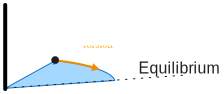
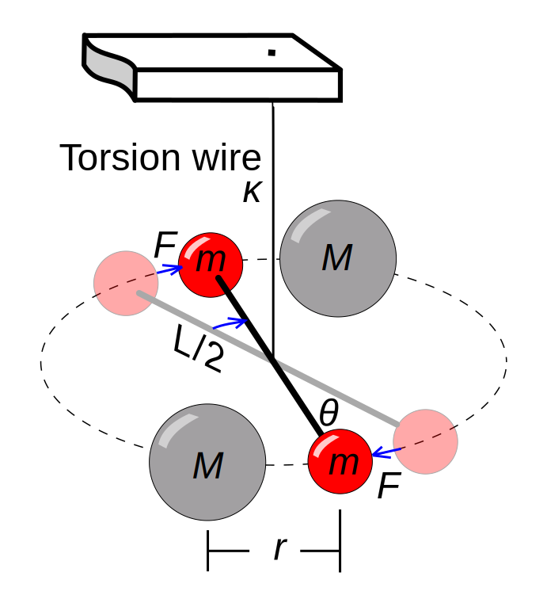
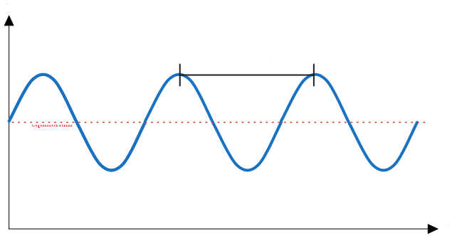

# Cavendish-Experiment
## Torsion Pendulum
Torsion wires are wires which exert a torque opposite and proportional to the displacement angle ${ \theta }$

The $k$ represents the torsion coefficient and is a property of the wire itself
The wire naturally oscillates with a period of ${\omega =  \sqrt{  \dfrac{k}{I}} }$  where $I$ is the moment of inerti (simple harmonic oscillator)
Furthermore, Newton's Law of Gravity suggests that two bodies with Masses $m_{1}m_{2}$ are attracted by a Force ${ F = G \dfrac{m_{1}m_{2}}{r_{12}^{2}} }$ where $G$ is the Gravitational constant and $r_{12}$ the distance between ${ m_{1} }$  and ${ m_{2} }$.
We construct a harmonic oscillate which uses the two facts above:

This means on each of the $m$'s has two opposite torques acting on it: 
 ${F_{\text{grav}} =  G \dfrac{2mM}{r^{2}}  }$   (The forces between $m$'s are compensated by the rod in-between). 
 And ${ F_{\text{tor}}  = 2M_{\text{torsion}} \cdot \dfrac{L}{2}= M_{\text{torsion} } \cdot L = k\theta L }$
 At equilibrium this means ${F_{\text{grav}} + F_{\text{tor}} =0 \implies G \dfrac{2mM}{r^{2}} = kL\theta_{\text{equilibirum}}  \qquad \mathrm{I} }$.  
We now calculate the moment of inertia for our ${ m }$'s, and—neglecting the rod—get ${ I = m\left( \dfrac{L}{2}^{2} \right) + m \left( \dfrac{L}{2} \right)^{2} = \dfrac{mL^{2}}{2} }$. 
Inserting that into the expressions yields ${ \omega = \sqrt{ 2 \dfrac{k}{mL^{2}} }   \implies k = \dfrac{\omega^{2}mL^{2}}{2}}$ (which is useful since determining $k$ directly is difficult)
With eq. $\mathrm{II}$ we get ${ G \dfrac{2 m M}{r^{2}} = \dfrac{\omega^{2}mL^{2}}{2}L\theta_{e}  \implies G =  \dfrac{\omega^{2}Lr^{2}\theta_{e}}{4M}}$

This means in the end we need to measure ${ \theta _{\text{equilibrium}}}$ (how much $\theta$ is extended from it's torsion-equilibrium with the ), $r$ the distance between the large and small spheres and $\omega$ the radial velocity of the rod.

Ideally we measure a time series of $\theta$ and from that determine $r$, $\omega$ and ${ \theta_{\text{equilibrium}} }$ from it:
$\theta (t)$ can be measured by mounting a mirror to the rod of the $m$'s and shining a laser onto it at a steep an angle as possible and projecting it onto a wall.  Then we can take measurements of the spot on the wall and infer the angle from it. By measuring the period of the oscillation, we can retrieve ${ \omega }$ and ${ \theta_{\text{equilibrium}} }$ will be the value $\theta$ oscillates around (where ${ \ddot{\theta} = 0 }$). 

Before or after the experiment we can then measure the angle ${ \theta_{\max} }$ where $r$ would be $0$ and infer $r$ at ${ \theta_{\text{equilibrium}} }$ from it.

