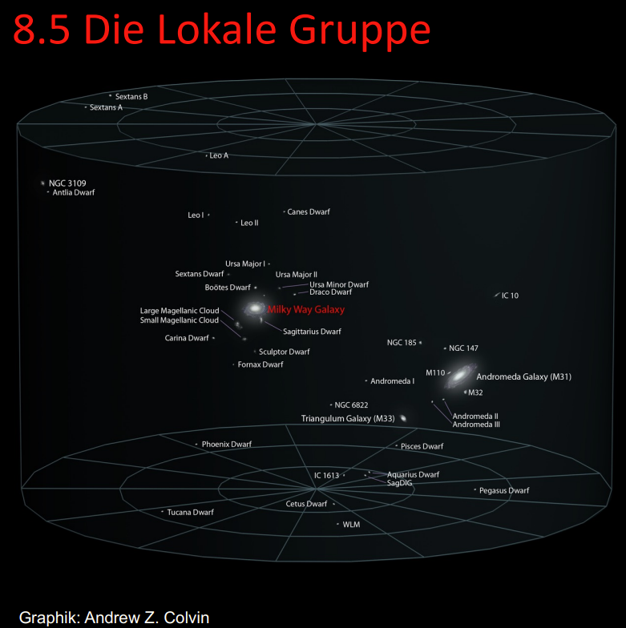
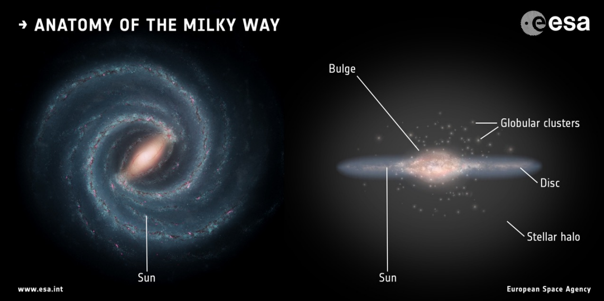
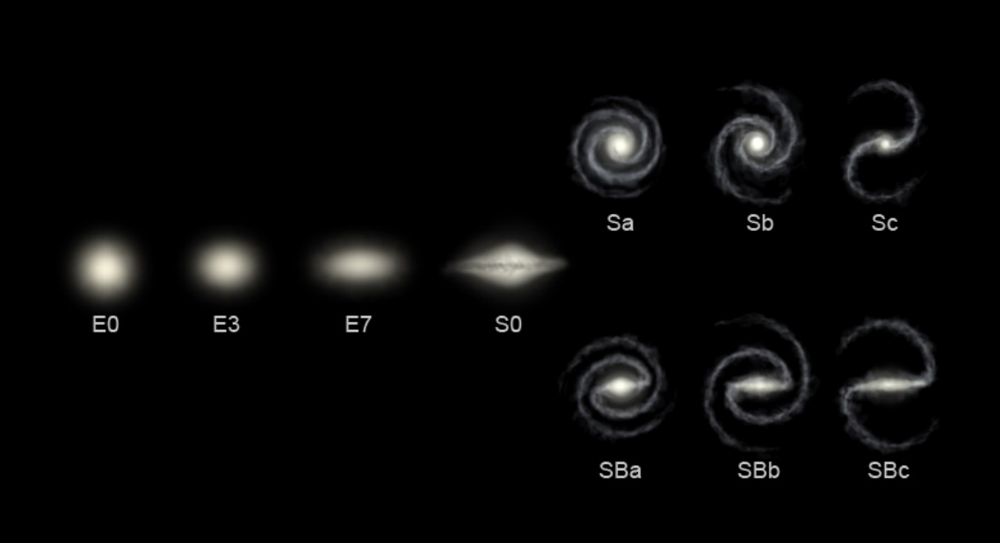
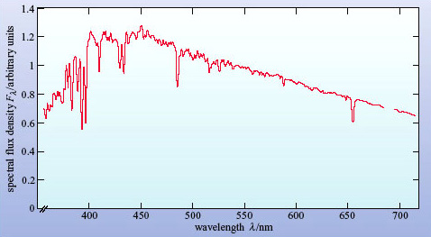
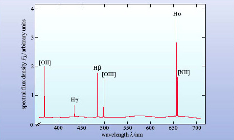
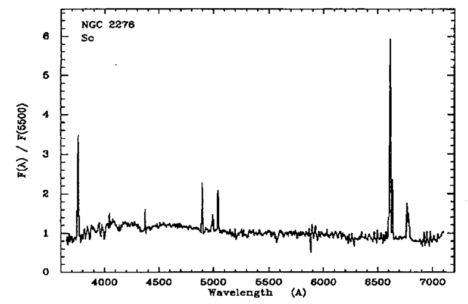
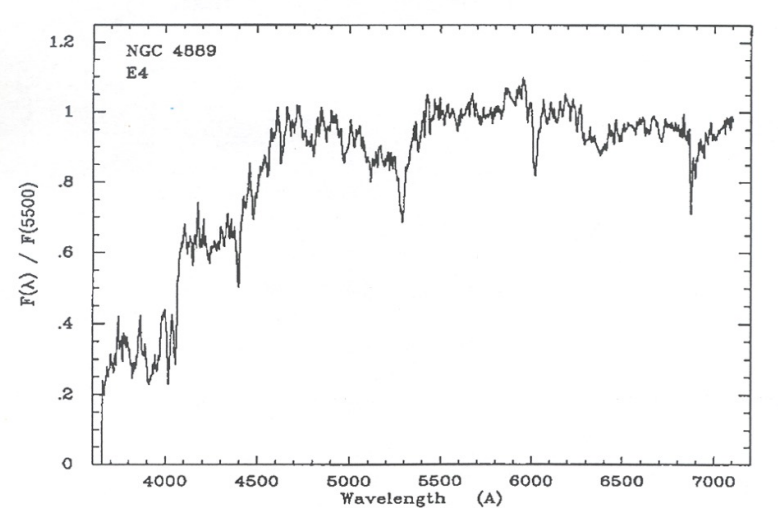

# Theory

## Galaxies 

### General
- Galaxies consist of **stars, planets, clouds of gas and dust and dark matter**, bound together by gravity. Most large ones have a **supermassive black** hole at their center.
- They range in size from a few hundret light-years wide, with a few thousand stars to more than a million light-years across containing trillions of stars.
- **The Milky Way** and the **Andromeda Galaxy** form a binary system of spiral galaxies and are the largest galaxies in the **Local Group**, a collection of about 50 galaxies.

- The Local Group is part of the Virgo Supercluster, which consists of approximately 100 galaxy groups and smaller clusters. It is about 100 million light-years in size.

### Anatomy (Milky Way/ Spiral Galaxy)

- **Bulge:** Dense central region, old stars.
- **Disk:** Spiral arms, active star formation.
- **Halo:** Globular clusters, dark matter.
- **Supermassive black holes** often reside in the center.

### Types of Galaxies / Hubble Sequence
The Hubble Sequence is not an evolution Sequence.
- **"S" Galaxies**, regular spiral galaxies (sometimes "SA"): central bulge and disk with spiral structure
  - About 77% of the observed galaxies in the universe are spiral galaxies.
  - The arms have a lot of gas and dust. They are often areas where stars are forming.
  - In the bulge there are primarily old stars. There is little star formation.
  - great amount of rotation
- **"SB" Galaxies**, barred spiral galaxies: central bulge, a bar, and a disk with spiral structure (usually)
- **"E" Galaxies**, elliptical galaxies: spherical or ellipsoidal shape, very homogeneous brightness distribution, without a disk
  - There is very little gas and dust, hence little star formation. Most of theirs stars are old.
  - little rotation
- **"Irr" Galaxies**, irregular galaxies
  - only about 3% of galaxies

## Spectroskopy

### Galaxy Spectra
Combination of spectra of stars, gas and dust.

- **Stars**:
  - continuous thermal spectrum with absobtion lines cut into it (see image)
  - contains information about chemical composition, surface temperature and luminosity
 

- **Gas**: hot clouds known as HII regions, regions of star formation
  - rich in ionizing gas, primarily hydrogen
  - the optical spectrum of HII regions consist of just a few emission lines (see image)
 

 
- **Dust**:
  - relatively cool
  - does not lead to emission in the optical spectrum, only at far-infrared wavelength
  - main effect in visible spectrum: absorbtion of starlight
 
**Spectrum of spiral galaxies:**

- star forming regions lead to clearly visible emission lines

**Spectrum of elliptical galaxies:**

  
### Doppler Shifts/ (Blue- and) Redshift

Due to the relative motion of the galaxies to us, their spectrum is shifted.
- **Redshift**: galaxies are moving away
- **Blueshift**: galaxies are moving towards us

#### Redshift Definition:
dimensionless quantity that expresses the relative shift in wavelength

$$ z = \frac{\lambda_{\text{observed}} - \lambda_{\text{rest}}}{\lambda_{\text{rest}}} $$

#### Non-relativistic Doppler Shift

$$\frac{\Delta \lambda}{\lambda_0} = \frac{v}{c}$$

#### Relativistic Doppler Shift

$$\frac{\lambda_{\text{obs}}}{\lambda_0} = \sqrt{\frac{1 + v/c}{1 - v/c}}$$

By rearranging, we get the formula for the relative velocity:

$$v = c \cdot \frac{(1+z)^2 - 1}{(1+z)^2 + 1}$$

## References

- Electrodynamics Script
- Astronomy Lectrures 8 and 9:
  [Astronomy 8](250412_HS23_Astronomie_Skript_Vorlesung8.pdf),
  [Astronomy 9](250412_HS23_Astronomie_Skript_Vorlesung9.pdf)
- [NASA](https://science.nasa.gov/universe/galaxies/)
- [SkyServers](https://skyserver.sdss.org/dr1/en/proj/advanced/galaxies/)
- [The Open University](https://www.open.edu/openlearn/science-maths-technology/introduction-active-galaxies/content-section-2.1)
- [Doppler Shift](https://itu.physics.uiowa.edu/labs/advanced/astronomical-redshift)
  
 

