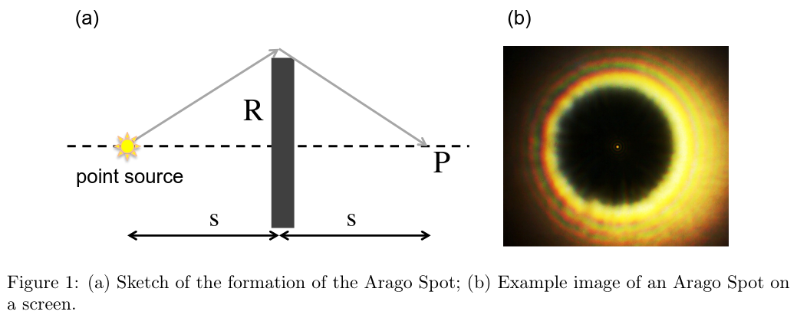
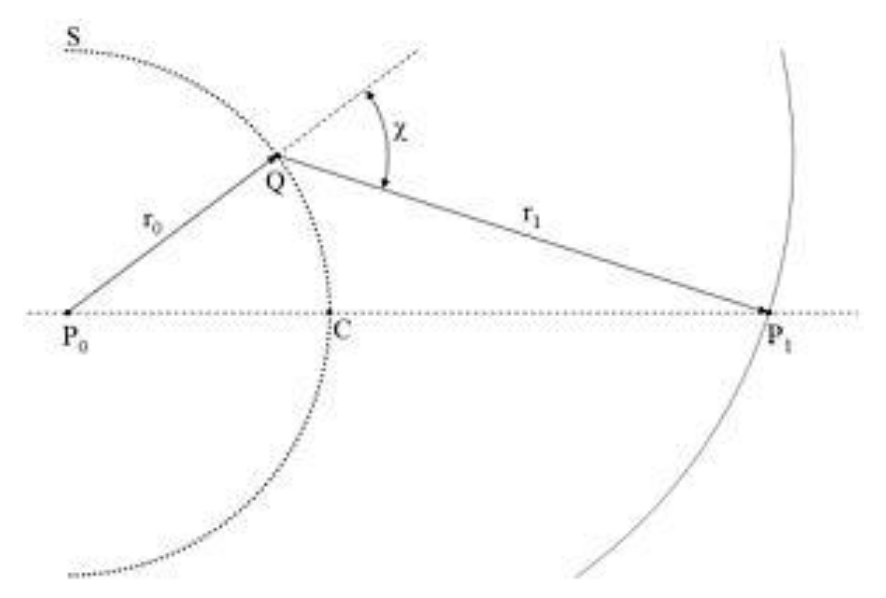

## Physics III, Johnson, Exercise Set 2, Exercise 2 Diffraction by a Disk
Point source at ${ 2s }$ from point detector with disk with radius ${ R \ll \lambda }$ normal to connecting line between source and detector centred on this line.

Sketch from Physics III:

Huygens principle: Every point of a wavefront (especially at the edge of the disk) can be considered a new point source of a spherical wave.

Consider a point on the edge of the disk, with a distance ${ r := \sqrt{x^{2} + y^{2}} }$ from the centre (where the connecting line pierces the disk) of the disk and a distance ${ \sqrt{r^{2} + s^{2}} }$ from the detector. In cylindrical coordinates, we can express the time-independent part of the electric field ${ U(r) }$ at the detector ${ P }$ as an integral over all possible point sources (on the plane of the lens)

$$U(P) \propto A_{0} \int_{R}^{\infty} r \int_{0}^{2\pi} \frac{e^{ik\sqrt{s^{2} + r^{2}}}}{\sqrt{s^{2} + r^{2}}} \frac{e^{ik\sqrt{s^{2} + r^{2}}}}{\sqrt{s^{2} + r^{2}}} \ \mathrm{d}\theta \ \mathrm{d}r = 2\pi A_{0} \int_{R}^{\infty} \frac{re^{2ik\sqrt{s^{2} + r^{2}}}}{s^{2} + r^{2}} \ \mathrm{d}r$$

and using the substitution

$$u = 2k\sqrt{s^{2} + r^{2}} \implies \mathrm{d}u = \frac{2kr}{\sqrt{s^{2} + r^{2}}} \ \mathrm{d}r,$$

we get

$$U(P) \propto 2\pi A_{0} \int_{2k\sqrt{s^{2} + R^{2}}}^{\infty} \frac{1}{u} e^{iu} \ \mathrm{d}u \approx \frac{\pi iA_{0}}{k\sqrt{s^{2} + R^{2}}} e^{2ik\sqrt{s^{2} + R^{2}}},$$

where in the last step, we use the approximation:

$$\int_{a}^{\infty} \frac{1}{x} e^{ix} \ \mathrm{d}x \approx \frac{i}{a} e^{ia}$$

for ${ a }$ large enough, which holds for ${ R \gg \lambda }$.

Using Fermat's principle, we get the minimal path for ${ r \to R \implies 2\sqrt{s^{2} + R^{2}} }$ with a total phase of

$$\phi = e^{2i\sqrt{s^{2} + R^{2}} \cdot 2\pi/\lambda} = e^{2ik\sqrt{s^{2} + R^{2}}},$$

which is the phase part of the above expression for ${ U(P) }$.

To calculate the intensity correctly, we need to assume in total ${ s \gg R \gg \lambda }$.

Including the angle ${ \chi }$ like so ([source](https://www.kth.se/files/view/phber/5836daca12b51d10425971b3/arago092015.pdf/)):

we get a more accurate expression for the spatial part of the wave:

$$U(P) = \frac{A_{0}i}{2\lambda} \int_{R}^{\infty} r \int_{0}^{2\pi} \frac{e^{ik\sqrt{s^{2} + r^{2}}}}{\sqrt{s^{2} + r^{2}}} \frac{e^{ik\sqrt{s^{2} + r^{2}}}}{\sqrt{s^{2} + r^{2}}} (1 + \cos \chi) \ \mathrm{d}\theta \ \mathrm{d}r,$$

from which we get the intensity:

$$I(P) = \frac{s^{2}}{s^{2} + R^{2}} I_{0} \xrightarrow{s \gg R} I_{0}$$

To get an optimal result, the Fresnel number ${ F }$ should not be too small:

$$F := \frac{4R^{2}}{s\lambda} \gtrsim 1,$$

as when ${ F \ll 1 }$, near-field diffraction is not a good approximation anymore and Fraunhofer diffraction should be considered.

For other shapes close to circles, other spots appear, e.g. for an ellipse, the spot has the shape of an evolute (the locus of all the centres of curvature). But if small-scale deviations (surface roughness) appear, the interference cancels out quickly: the deviation should not be much more than 10% of the Fresnel zone to see an ideal spot. The Fresnel zone for a ${ \pu{4mm} }$ disk is about ${ \pu{77\micro m} }$.
